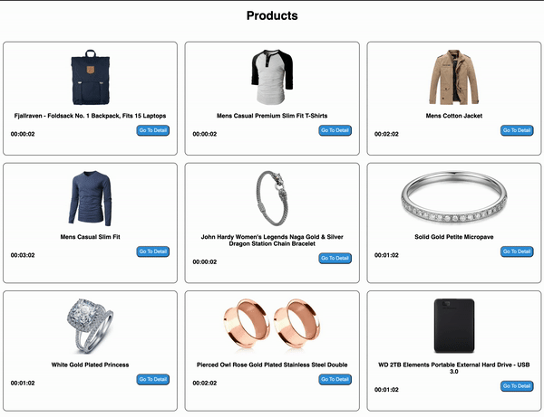
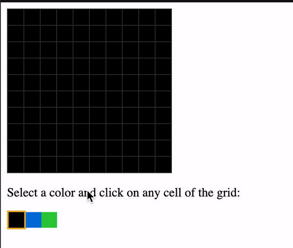

# Assesment I

El objetivo de esta misión es poner en práctica lo que has aprendido en el programa. Los temas que se cubrirán son: Scrum, Git, HTML y CSS, JavaScript y React.

La misión consta de dos partes: primero deberás construir un proyecto en React y después deberás responder una serie de preguntas. **En el reporte de la misión deberás agregar el link al repositorio del proyecto y las respuestas a las preguntas.**

La fecha limite para la entrega será el **viernes 24 de Diciembre**.

## 1. Proyecto

Construir una aplicación web la cual consta de tres páginas:

- Home
- Product Detail
- About

La aplicación debe tener un menú que le permita al usuario navegar entre estas páginas.

### Requerimientos

- Usar Flexbox CSS.
- El proyecto debe tener configurado ESLint y el Prettier y que tus archivos no tengan problemas con estos.
- El código del proyecto debe estar en un repositorio público de tu autoría.
- Bonus: Implementar tu CSS con BEM o módulos de CSS.

### Home Page

Esta página tendrá la responsabilidad de listar una serie de productos que debes obtener consumiendo la api de [Fake Store API](https://fakestoreapi.com/).

Para mostrar estos productos debes crear un componente llamada `ProductCard` el cual tendrá como propiedades `id`, `title`, `image` las cuales tienen que estar renderizadas. Este componente tiene la particularidad de permitir ir al detalle del producto en otra página (`http://localhost:3000/detalle/:id`) en la cual se debe renderizar toda la información del producto en detalle de forma visualmente agradable.

```json
{
  "id": 1,
  "title": "Fjallraven - Foldsack No. 1 Backpack, Fits 15 Laptops",
  "price": 109.95,
  "description": "Your perfect pack for everyday use and walks in the forest. Stash your laptop (up to 15 inches) in the padded sleeve, your everyday",
  "category": "men's clothing",
  "image": "https://fakestoreapi.com/img/81fPKd-2AYL._AC_SL1500_.jpg",
  "rating": {
    "rate": 3.9,
    "count": 120
  }
}
```

Además el componente `ProductCard` solo debe permitir ir a la página de detalle siempre y cuando un tiempo random configurado de forma aleatoria no se haya vencido. El tiempo restante debe mostrarse en pantalla como una cuenta regresiva para actualizarse cada segundo.

**Ejemplos**:

- `ProductCard-1`: Tiene un tiempo máximo para ir al detalle de **1 min**, cuando el tiempo finalice este `Card` no debe permitir realizar una navegación.
- `ProductCard-2`: Tiene un tiempo máximo para ir al detalle de **3 min**, cuando el tiempo finalice este `Card` no debe permitir realizar una navegación.
- `ProductCard-3`: Tiene un tiempo máximo para ir al detalle de **1 min**, cuando el tiempo finalice este `Card` no debe permitir realizar una navegación.

Este es un ejemplo aproximado de lo que debes hacer:



### Product Detail Page

Renderizar la información del producto y permitir navegar a la página de inicio o la del perfil.

### About Page

Debes mostrar en esta pantalla tu información personal:

- Nombre
- Descripción
- Imagen
- Lista de 3 cosas que hayas aprendido en este programa
- Correo
- Link a tu Github

## ALTERNATIVA Proyecto (Programas TOP parciales)
Escuchando a sus observaciones y todo el feedback dado, hemos decidido crear una alternativa para el punto 1 (proyecto) el cual consiste en hacer un ejercicio para generar un grid de NxN cuadriculas, como se ve en la imagen.



La idea es simple, generar un grid de un determinado numero, deben ahcer uso del `useState`.

Aca les dejamos el [codigo del ejemplo](https://codesandbox.io/s/color-grid-exercise-t3iwe) para que lo revisen y generen el enunciado si deciden usar esta alternativa.

## 2. Preguntas

1. ¿Cuáles son las ceremonias más importantes de un Sprint y cuál es la idea de cada una?
2. ¿Qué son los Wireframes? Nombra al menos una herramienta que podamos utilizar.
3. Explicar la diferencia entre `var`, `let` y `const`. Y dar un ejemplo en qué caso se utilizará.
4. ¿Cuáles son los tres comandos que se pueden utilizar para crear una nueva rama llamada `rama-1`?
5. Explicar la diferencia entre git merge y git rebase.
6. ¿Cuál es la diferencia entre Pull Request (PR) y el comando `git pull`?
7. ¿Qué es el Virtual DOM?
8. Dado el siguiente [codePen](https://codepen.io/cristian-makeitreal/pen/NWadqqa?editors=1100), el cual solo tiene un HTML, por medio de css llegar a esta respuesta. [Imagen](./assets/services-section.gif). (Para mostrar los servicios debes usar CSS Flexbox o CSS Grid).
